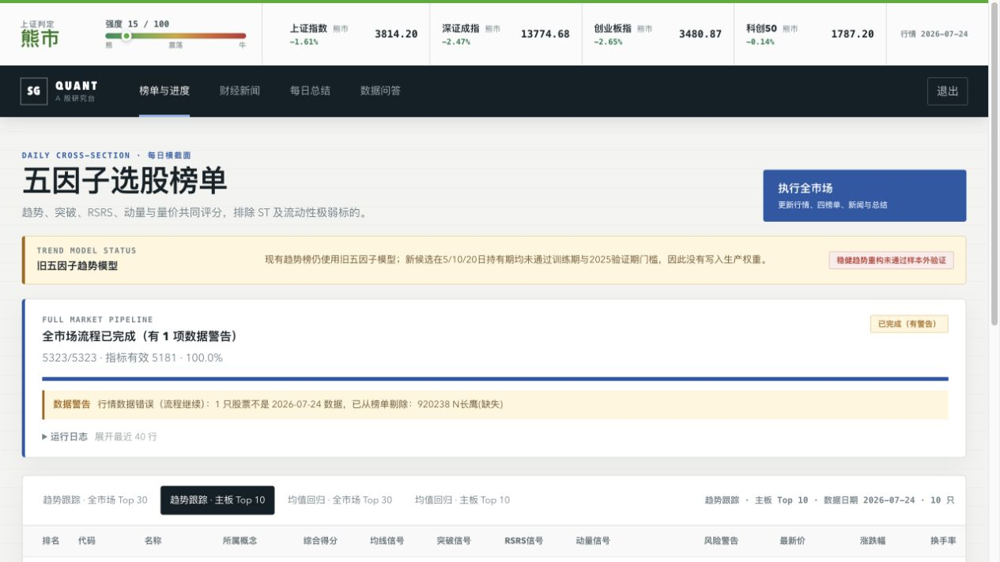
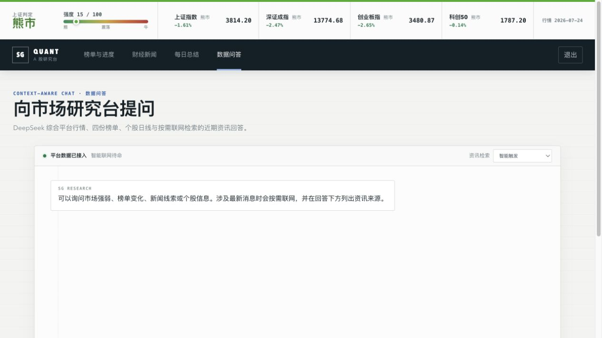
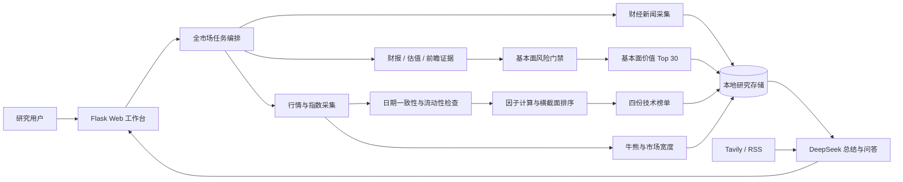

# SG｜AI 驱动的 A 股研究工作台

> 一份面向 AI 产品经理岗位的作品集项目：把基本面研究、估值、风险门禁、行情、新闻和大模型能力，组织成可追溯、可降级、可复盘的每日投研流程。

[在线案例页](https://ross912.github.io/SG/) · [精简 PRD](docs/portfolio/PRD.md) · [架构与用户流程](docs/portfolio/ARCHITECTURE.md) · [演示脚本](docs/portfolio/DEMO.md) · [失败实验与复盘](docs/portfolio/RETROSPECTIVE.md)

> 当前仓库是脱敏公开版，不含 API Key、全量行情、用户数据、日志和部署密钥。项目用于研究与作品展示，不构成投资建议。

## 30 秒项目摘要

个人投资者每天需要在行情、新闻、技术指标和市场情绪之间反复切换。SG 将这条链路收敛为一个工作台：

1. 以财务质量、估值、历史成长、未来空间和暴雷风险筛出基本面价值 Top 30；
2. 15:35 后增量补齐当日行情，并检查交易中股票的数据日期一致性；
3. 保留趋势与均值回归四份技术榜单，作为独立研究视角；
4. 以四大指数和全市场宽度判断市场状态；
5. 聚合财经新闻，由 DeepSeek 生成结构化每日总结；
6. 在问答区将本地市场数据与 Tavily/RSS 最新资讯共同作为回答依据；
7. 全流程展示阶段、进度、警告和降级状态，局部数据缺失不会让用户“傻等”或丢失全部结果。

我在这个项目中承担产品定义、数据口径、AI 交互、异常策略、验证门槛和前端体验设计，并借助 AI 编程工具完成实现与测试。

## 为什么它是 AI 产品项目，而不只是“接了一个模型”

| 产品问题 | 设计决策 | 可验证结果 |
| --- | --- | --- |
| “低估值”不等于“值得买” | 质量、估值、成长、未来空间、风险五维评分；高风险硬剔除 | 基本面榜与技术榜分离，结果展示风险和数据置信度 |
| “发展空间”容易沦为主观叙事 | 使用行业财务景气、上市公司收入份额、业绩预告和机构 EPS 预测 | 缺少任一关键前瞻模块即低置信度并取消入榜资格 |
| 模型可能把旧数据说成今天 | 将行情日期、抓取时间和来源写入上下文；缺失时明确降级 | 过期股票被排除榜单，流程以警告完成 |
| 新闻接口不稳定 | 多源抓取，保留原标题与原文链接，单源失败不阻断 | 新闻与选股解耦 |
| 长任务缺乏反馈 | 统一任务状态：阶段、百分比、当前动作、警告 | 前端实时显示全市场流程和总结进度 |
| 联网搜索可能失败 | Tavily 主源，Google/Bing RSS 兜底，全部失败则退回本地数据 | 问答不中断且标明本次依据 |
| AI 输出直接暴露 Markdown | 后端保留结构化文本，前端安全渲染标题、列表和引用 | 每日总结与流式问答可读 |
| “新因子看起来更高级”但无效 | 训练/验证/测试隔离与生产门禁 | 候选未过门槛时拒绝上线并公开失败证据 |

## 产品截图





> 截图来自本地脱敏环境；行情与研究结果仅用于展示产品交互。

## 产品架构



更完整的边界、降级路径和用户流程见 [ARCHITECTURE.md](docs/portfolio/ARCHITECTURE.md)。

## 核心功能

- 基本面价值榜：质量 25、估值 25、历史成长 15、未来空间 20、风险控制 15，按行业或同模型组比较。
- 未来空间证据：行业营收景气、上市公司财报收入份额变化、公司业绩预告、机构下一年度 EPS 预测，以及公告中明确出现的研发、订单或扩产文字。
- 风险硬门禁：净资产为负、最新报告期亏损、极端杠杆、高质押、利润暴跌且现金流为负、业绩预告预计亏损等情形直接剔除；低风险仍明确提示不等于无风险。
- 分行业模型：金融、房地产、上市不足三年和一般企业采用不同阈值；关键前瞻数据缺失则不入榜，不用缺失值伪装确定性。
- 增量行情更新：只请求缺失区间，避免每次重抓历史数据。
- 数据质量门禁：15:35 后检查当日交易股票的数据日期；少于 10 只列明明细，更多则显示总数，流程不终止但异常股票不入榜。
- 市场状态栏：以上证指数作为主状态，辅以上证、深证、创业板、科创 50 的分市场状态。
- 五榜单并列：基本面价值全市场 Top 30 排在最前；趋势跟踪与均值回归分别输出主板 Top 10 和全市场 Top 30。
- 新闻页：聚合公开财经源，直接使用原标题，保留来源、时间和原文链接。
- 每日总结：榜单完成后自动触发 DeepSeek，读取行情、市场宽度、榜单与新闻并存档。
- 联网问答：SSE 流式输出；智能、强制联网、仅本地三种模式；展示实际使用的资讯来源。
- 安全与成本控制：密码登录、CSRF、会话限流、搜索缓存、Key 仅从环境变量读取。

## AI 交互与检索链路

```text
用户问题
  → 时效性识别
  → 本地行情 / 榜单 / 总结 / 新闻上下文
  → 如需联网：Tavily → 结果不足时 RSS 补充
  → 提示词注入防护与来源约束
  → DeepSeek SSE 流式回答
  → 正文 + 本次实际使用来源
```

模型不是事实数据库。SG 的原则是：数据层负责提供带日期的事实，模型负责组织与解释；搜索失败时明确降级，不伪装实时能力。

## 研究诚实性

公开版保留了未通过生产门禁的实验结果，而不是只展示“成功故事”：

- 候选趋势因子在训练或验证集上出现负 Rank IC；
- 标准化后的生产组合虽优于原始组合，但年化收益仍为负；
- 当前股票池缺少历史退市股票和历史时点行业分类，存在幸存者偏差；
- “上市公司财报收入份额”只代表同一行业上市样本中的相对份额，不能称为整个社会市场份额；
- 免费数据源不能稳定覆盖审计意见、监管调查和尚未披露事件，低风险不是无风险；
- 因此候选重构没有强行上线，现有榜单也不被描述为可直接实盘的盈利策略。

原始汇总证据位于 [`evidence/`](evidence/)，完整复盘见 [RETROSPECTIVE.md](docs/portfolio/RETROSPECTIVE.md)。

## 快速开始

环境：Python 3.12。

```bash
python3 -m venv .venv
source .venv/bin/activate
pip install -r requirements.txt
cp .env.example .env
```

在 `.env` 中填写自己的服务密钥：

```dotenv
TUSHARE_TOKEN=
DEEPSEEK_API_KEY=
DEEPSEEK_MODEL=deepseek-v4-flash
TAVILY_API_KEY=
SG_QUANT_DASHBOARD_PASSWORD=
SG_QUANT_SESSION_SECRET=
```

启动：

```bash
./run_online.sh
./run_local_mac.sh
```

如需忽略财报和前瞻缓存并立即复查：

```bash
python main.py --full --refresh-fundamentals
```

验证：

```bash
python -m unittest discover -s tests -v
python self_test.py
```

首次运行需要自行获取行情，公开仓库不分发全量市场数据。接口额度、网络质量和数据授权会影响运行时间。

## 代码地图

| 目录/文件 | 职责 |
| --- | --- |
| `main.py` | 全市场任务编排、增量更新、质量检查与榜单输出 |
| `dashboard.py` | 页面路由、登录、SSE、任务接口与限流 |
| `data/` | 行情、指数、概念、存储与请求速率控制 |
| `data/fundamentals.py` | 财报、估值和质押数据采集、缓存与口径降级 |
| `data/forward_outlook.py` | 业绩预告、机构盈利预测和前瞻证据缓存 |
| `screening/fundamental.py` | 五维基本面评分、分行业模型、置信度与风险硬门禁 |
| `screening/` | 股票资格、基本面和技术因子标准化、扫描与排名 |
| `strategy/` | 趋势、动量、RSRS 等策略实现 |
| `services/` | 新闻、DeepSeek、市场上下文、联网检索与进度状态 |
| `backtest/` | 回测引擎、候选因子研究与生产门禁 |
| `templates/`, `static/` | 工作台页面与设计系统 |
| `tests/` | 数据口径、AI 上下文、SSE 和流程回归测试 |

## 作品集材料

- [AI 产品经理案例页](https://ross912.github.io/SG/)
- [面向面试官的项目作品说明书（Word）](docs/portfolio/SG_AI产品经理项目作品说明书.docx)
- [简历中的 5 条项目经历](docs/portfolio/RESUME.md)
- [产品架构图和用户流程图](docs/portfolio/ARCHITECTURE.md)
- [PRD 精简版](docs/portfolio/PRD.md)
- [关键页面截图与演示脚本](docs/portfolio/DEMO.md)
- [已知问题、失败实验与迭代复盘](docs/portfolio/RETROSPECTIVE.md)
- [公开范围与安全说明](SECURITY.md)

## 项目边界

- 非交易系统，不执行下单，不提供收益承诺；
- 新闻聚合依赖公开接口，免费 RSS 没有 SLA；
- DeepSeek、Tushare、Tavily 均需使用者自行申请；
- 仓库不含真实 API Key、密码、Cookie、完整行情缓存、运行日志和敏感部署包；
- 源码公开用于作品评估，版权保留，未授予商业再分发许可。
