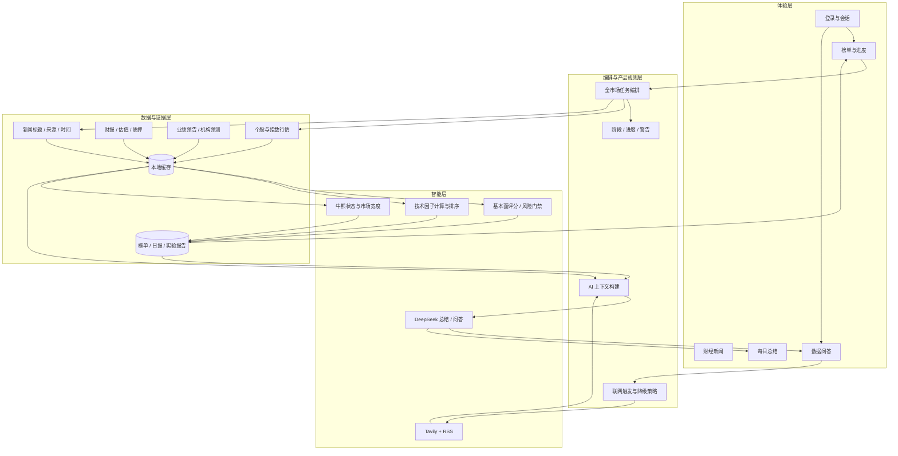
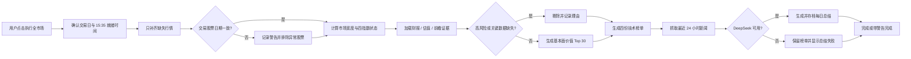
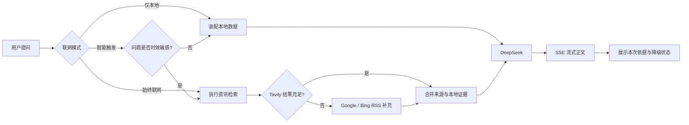

# 产品架构与用户流程

## 一、产品架构图

## 二、每日全市场用户流程

## 三、问答用户流程

## 四、关键产品边界

| 边界 | 产品约束 |
| --- | --- |
| 模型与事实 | 行情、榜单、新闻由数据层提供；模型只解释，不生成缺失事实 |
| 基本面与技术 | 基本面榜不以日 K 信号决定入选；四份技术榜保留为独立视角 |
| 发展空间 | 使用可追溯的财务与前瞻证据；关键模块缺失时不入榜 |
| 核心与增强 | 五份榜单是核心产物；新闻、搜索、AI 总结是可降级增强能力 |
| 数据异常 | 不终止整批任务，但异常股票不参与当日排名 |
| 实时性 | 明确数据日期和搜索时间，不将缓存数据描述为实时 |
| 策略实验 | 通过生产门禁才允许替换权重；失败实验保留证据 |
| 交易风险 | 不下单、不承诺收益、不将研究榜单包装为投资建议 |
